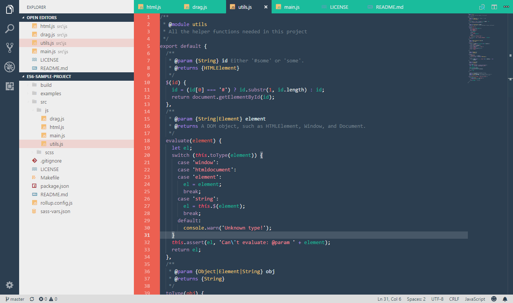

# Hipster Theme

<strong>A very colorful Visual Studio Code theme based on the [Atom Hipster](https://github.com/Agnostics/atom-hipster-ui) theme.</strong>

[Installing](#Installing) • [Credits](#Credits)

## Installing
This extension is available in the [Visual Studio Code Marketplace](https://marketplace.visualstudio.com/items/ModoNoob.vscode-hipster-theme)

## Credits
- [Agnostics](https://github.com/Agnostics) for the original [Atom Hipster theme](https://github.com/Agnostics/atom-hipster-ui).
- Project shown in the screenshot is [this es6  sample](https://github.com/jonataswalker/es6-sample-project) by [jonataswalker](https://github.com/jonataswalker)
- Theme logo based on [this](https://www.deviantart.com/migradj/art/Visual-Studio-2017-Classic-Color-Icon-668083959) logo by [MigraDJ](https://www.deviantart.com/migradj/) on DeviantArt
